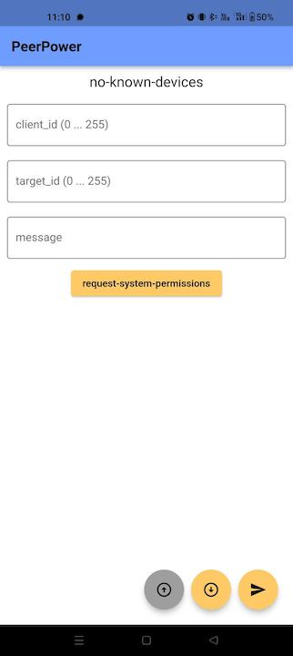

# PeerPower
> ### When the grid goes down, PeerPower stays up.

- [Gawain Marti](https://github.com/Cryptric)
- [Ilija Pejic](https://github.com/To-Ye)
- [Alexander Eggerth](https://github.com/AlexTheTallCoder)
- [Samuel Kreyenbühl](https://github.com/SamKry)

Im Rahmen vom **HACKATHON THURGAU 2023** haben wir PeerPower entwickelt.

PeerPower ermöglicht ein Offline Kommunikations-Netzwerk mittels BLE (Bluetooth Low Energy). 

Dabei Stehen folgende Punkte im Zetrum:

+ Offline Kommunikation
+ Das Nutzen bestehender Hardware
+ Kostengünstige Implementation
+ Tiefen Energieverbrauch durch SOS-Protokoll und BLE (Bluetooth Low Energy) + Skalierbarkeit
+ Vielzahl von Erweiterungsmöglichkeiten
+ Erhöhte Widerstandsfähigkeit
+ Plattformunabhängige Applikation (Flutter)

Für weitere Informationen sehen Sie sich gerne die Präsentation an: 
[Präsentation (PDF)](Resources/PeerPower_ppt.pdf)

## PeerPower App

## Erweiterung durch ESP-32 Repeaters

Mittels kostengünstigen ESP-32 Mikrocontrollern kann das Netzwerk weiter ausgebaut und verstärkt werden.

- [ESP32 code](ESP32/Sandbox) 

NOTE: Aktuell steht noch keine direte Kommunikation mit der PeerPower App. 